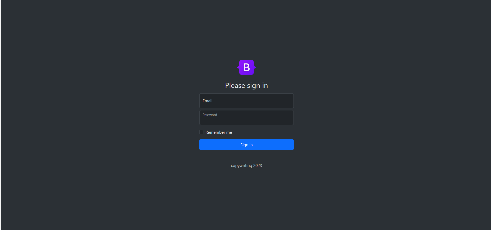

# Formulário BootStrap 5

> Resultado do Projeto Formulário Bootstrap 5.

### Sobre

O projeto trata-se de um Formulário desenvolvido em BootStrap 5
- [x] Criação do HTML
- [x] Criação da ESTILIZAÇÃO EM BS 5 
- [x] Responsividade

## Ver o Projeto: 

<a 
href="https://vagner0795.github.io/convert-money/" target="_blank">Abrir Projeto✅</a>

## 🤝 Colaboradores

Agradecemos às seguintes pessoas que contribuíram para este projeto:

<table>
  <tr>
    <td align="center">
      <a href="#">
         
        
          <b>Vagner Santos</b>
        
      </a>
    </td>
  </tr>
</table>

